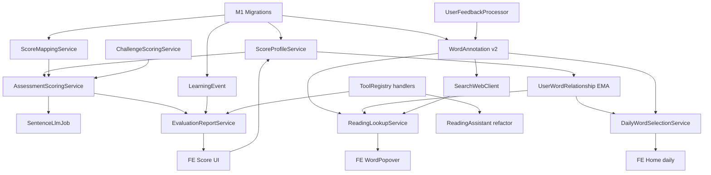

# NextWord AI 学习系统 — 实现规格书

> **文档版本**：2026-06-30 v2  
> **状态**：完整 v1 开发规格  
> **上游**：产品 spec · 团队收敛纪要 · 风险登记册  
> **Tech**：ASP.NET Core 8 · EF Core · React/Vite/TS · Microsoft.Extensions.AI

---

## 0. 实现原则

1. **无对外分期**：任务按 §7 DAG 排序，全部完成后统一发布。  
2. **设计先于编码**：§1–§6 为开工门禁；未列项不得 improvised。  
3. **可测试性**：每个 Service 有单元测试；每条 FR 有集成测试。  
4. **幂等与单一写者**：Score 变更只经 `ScoreProfileService`。

---

## 1. 领域模型

### 1.1 UserProgress 扩展（不新建 UserProfile 表）

```csharp
public class UserProgress
{
    // --- 新增 Score 字段 ---
    public int? VocabularyScore { get; set; }
    public int? ReadingScore { get; set; }
    public int? WritingScore { get; set; }
    public int? SpellingScore { get; set; }
    // OverallScore: 不持久化，见 §1.2

    public string? DifficultyBucket { get; set; }  // 投影缓存
    public string? CefrDisplay { get; set; }
    public DateTime? ScoresUpdatedAt { get; set; }
    public int ScoreSchemaVersion { get; set; } = 1;
    public string? LegacyCefrJson { get; set; }    // 迁移审计

    // --- 保留至 v1 结束 ---
    public string? OverallLevel { get; set; }      // 写时同步投影，读禁止
    // ...existing fields
}
```

### 1.2 OverallScore 策略

```csharp
public int ComputeOverall(UserProgress p) =>
    Math.Min(
        p.VocabularyScore ?? 0,
        Math.Min(p.ReadingScore ?? 0, p.WritingScore ?? 0));
```

**规则**：Spelling 不参与 Overall；API 返回 computed 字段。

### 1.3 UserWordRelationship 扩展

```csharp
public class UserWordRelationship
{
    // existing: WordId, MasteryScore, SM-2 fields...
    public double EstimatedKnownRate { get; set; } = 0.5;
    public int? PersonalDifficulty { get; set; }
    public DateTime? PersonalUpdatedAt { get; set; }
}
```

**EMA 更新**（每次 vocab/spelling/review 交互）：

```csharp
knownRate = Clamp01(knownRate + α * (outcome - knownRate));  // α=0.3
personal = Clamp(0, 100, intrinsic + (int)((1-knownRate)*20) - 10);
```

### 1.4 WordDifficultyAnnotation（append-only）

```csharp
public class WordDifficultyAnnotation
{
    public long Id { get; set; }
    public string Word { get; set; }              // normalized lemma, unique per version
    public int Version { get; set; }
    public bool IsCurrent { get; set; }           // 仅一条 true/word
    public int IntrinsicScore { get; set; }
    public string DimensionsJson { get; set; }    // schemaVersion inside
    public double Confidence { get; set; }
    public string? Reason { get; set; }
    public string? SourcesJson { get; set; }
    public string ModelProfileId { get; set; }
    public string PromptVersion { get; set; }
    public int SchemaVersion { get; set; }
    public DateTime CreatedAt { get; set; }
}
```

索引：`(Word, IsCurrent)` filtered unique where IsCurrent=1。

### 1.5 LearningEvent（新表，审计+历史 API）

```csharp
public class LearningEvent
{
    public long Id { get; set; }
    public Guid UserId { get; set; }
    public string EventType { get; set; }   // AssessmentCompleted, ChallengePassed, ...
    public string PayloadJson { get; set; } // 含各维 delta、raw scores
    public DateTime OccurredAt { get; set; }
    public string IdempotencyKey { get; set; }
}
```

### 1.6 ProfileScoreSnapshot（日终）

```csharp
public class ProfileScoreSnapshot
{
    public long Id { get; set; }
    public Guid UserId { get; set; }
    public DateOnly Date { get; set; }
    public string ScoresJson { get; set; }
}
```

### 1.7 EvaluationReport

```csharp
public class EvaluationReport
{
    public long Id { get; set; }
    public Guid UserId { get; set; }
    public string TriggerType { get; set; }
    public long? AssessmentId { get; set; }
    public string InputSnapshotJson { get; set; }  // 冻结 evidence+profile
    public string InputSnapshotHash { get; set; }
    public string ContentJson { get; set; }      // LLM narrative only merged
    public string Status { get; set; }           // Pending|Ready|Failed
    public string IdempotencyKey { get; set; }
    public string ModelProfileId { get; set; }
    public DateTime CreatedAt { get; set; }
}
```

### 1.8 UserFeedback（FR-7）

```csharp
public class UserFeedback
{
    public long Id { get; set; }
    public Guid UserId { get; set; }
    public string FeedbackType { get; set; }  // DefinitionWrong, ExcludeWord, MarkKnown
    public string TargetWord { get; set; }
    public string? ContextJson { get; set; }
    public string Status { get; set; }        // Pending, Processed
    public DateTime CreatedAt { get; set; }
}
```

### 1.9 EffectiveDifficulty 优先级矩阵

| 优先级 | 来源 |
|--------|------|
| 1 | UserWordRelationship.PersonalDifficulty（有值） |
| 2 | f(intrinsic, knownRate, context.register) |
| 3 | WordDifficultyAnnotation.IntrinsicScore |
| 4 | Legacy DifficultyLevel→Score 映射表 |
| 5 | 启发式（词长/频率），仅 pending 态 |

### 1.10 Word 规范化

```csharp
public static string NormalizeLemma(string token) =>
    token.Trim().ToLowerInvariant().TrimEnd('.,;:!?');
```

所有 annotation / relationship join 必须先 Normalize。

---

## 2. 核心服务

### 2.1 ScoreProfileService（唯一写者）

```csharp
public interface IScoreProfileService
{
    Task<UserProgress> ApplyUpdateAsync(ProfileUpdateCommand cmd, CancellationToken ct);
}

public record ProfileUpdateCommand(
    Guid UserId,
    string Source,           // Assessment, Challenge, Sentence, Spelling, Review
    int? VocabularyDelta,
    int? ReadingDelta,
    int? WritingDelta,
    int? SpellingDelta,
    string IdempotencyKey,
    string? PayloadJson);
```

**事务内**：

1. 应用 delta / 绝对赋值（Assessment 用绝对）
2. Clamp 0–100
3. 投影 DifficultyBucket, CefrDisplay via IScoreMappingService
4. 双写 legacy OverallLevel（投影值，非业务读）
5. Insert LearningEvent
6. Update ScoresUpdatedAt

### 2.2 IScoreMappingService

配置见 appsettings `ScoreMapping`（产品 spec §6）。

### 2.3 AssessmentScoringService（改造）

**流程**：

```
Step1 vocab accuracy → VocabularyScore (0-100 linear)
Step2 spelling → SpellingScore
Step3 sentences:
  sync: heuristic provisional → WritingScore (provisional flag in event)
  async job: LLM → final WritingScore if delta
Step4 reading → ReadingScore (fix lookupCount penalty)
→ ScoreProfileService.ApplyUpdate (idempotency: assessmentId)
→ Enqueue EvaluationReportJob(snapshot at this moment)
→ Enqueue SentenceLlmScoringJob if sentences exist
```

**初测造句 LLM Job**：完成后若 |final-provisional|≥5 → 可选 push/in-app notice。

### 2.4 EvaluationReportService

```csharp
// 1. EvaluationDataAssembler (C#) — 非 LLM tool loop
var snapshot = BuildSnapshot(userId, assessmentId);
var evidence = await _assembler.GatherAsync(userId, assessmentId);

// 2. Persist report Pending + InputSnapshotJson

// 3. Wait sentence job (optional WaitHandle, max 30s)

// 4. Single LLM structured call — schema WITHOUT score fields
var narrative = await _llm.GetStructuredAsync<NarrativeDto>(prompt);

// 5. Merge — SERVER WINS for all numeric fields
content.Evidence = evidence;
content.ProfileSnapshot = snapshot;
content.Summary = narrative.Summary;
// validator: regex CEFR in summary must match snapshot.CefrDisplay

// 6. Status = Ready
```

**NarrativeDto schema**：仅 `summary`, `strengths[]`, `weaknesses[]`, `recommendations[]`.

### 2.5 DifficultyAnnotationService

```csharp
public async Task<AnnotationResult> GetOrCreateAsync(string word, CancellationToken ct)
{
    await _singleFlight.WaitAsync(NormalizeLemma(word), ct);
    var current = await _repo.GetCurrentAsync(word);
    if (current?.Confidence >= 0.6) return Map(current);

    var dto = await _llm.AnnotateAsync(word);  // structured, schema v1
    Validate(dto);  // reject out of range
    await _repo.AppendVersionAsync(word, dto); // marks old IsCurrent=false
    return Map(dto);
}
```

**Singleflight**：内存 + DB `AnnotationPending` row optional。

### 2.6 ReadingLookupService

```csharp
public async Task<LookupResponse> LookupAsync(LookupRequest req, Guid userId, ct)
{
    var lemma = NormalizeLemma(req.Word);
    var annotation = await _annotation.GetOrCreateAsync(lemma, ct);
    var rel = await _wordRel.GetAsync(userId, lemma);
    var effective = EffectiveDifficulty.Compute(annotation, rel, req.Context);

    var contextDef = await _llm.ContextDefineAsync(lemma, req.SentenceSnippet);
    // fallback: mock + offline flag

    if (annotation.Confidence < 0.6 && _searchEnabled)
        sources = await _search.SearchAsync($"{lemma} definition", 3, ct);

    return new LookupResponse { ... };
}
```

### 2.7 DailyWordSelectionService

见产品 FR-3；SQL 需 `(IntrinsicScore)` 索引 + user-specific effective 计算在应用层或 indexed view。

### 2.8 LearningToolRegistry

```csharp
public interface ILearningToolHandler
{
    string Name { get; }
    Task<object> ExecuteAsync(JsonElement args, Guid userId, CancellationToken ct);
}
```

Handlers 全部只读；`search_web` 禁止调用 `DifficultyAnnotationService.Upsert`.

### 2.9 UserFeedbackProcessor（FR-7）

- DefinitionWrong → enqueue ReAnnotationJob(low priority)
- ExcludeWord → UserWordExclude table
- MarkKnown → knownRate = min(0.95, knownRate + 0.2) via ScoreProfileService side path

### 2.10 ChallengeScoringService（FR-6 选项 A — 已确认）

**v1**：完整交互式挑战 UI + Score 阈值；禁止自报 stub。

```json
{
  "VocabAccuracyMin": 0.60,
  "WritingScoreMin": 53,
  "ReadingScoreMin": 100,
  "UpgradeDelta": 5
}
```

通过 → Profile 各维 +UpgradeDelta（cap 100）→ EvaluationReport(ChallengePass).

---

## 3. API 完整清单

| Method | Path | 说明 |
|--------|------|------|
| GET | `/api/profile/scores` | computed overall + dims + projections |
| GET | `/api/profile/scores/history` | ProfileScoreSnapshot 序列 |
| POST | `/api/assessment/{id}/complete` | 返回 scores 立即；reportId async |
| GET | `/api/evaluation/{id}` | status + content |
| GET | `/api/evaluation/latest` | 最近 Ready |
| POST | `/api/evaluation/generate` | manual, 429 if 24h |
| POST | `/api/reading/lookup` | FR-2 |
| GET | `/api/words/daily` | FR-3 |
| POST | `/api/feedback` | FR-7 body `{type, word, context?}` |
| POST | `/api/challenge/{id}/submit` | FR-6 |
| GET | `/api/challenge/current` | FR-6 |
| POST | `/api/internal/annotate/word` | Admin key |
| GET | `/api/internal/jobs/{id}` | Admin key |

**Breaking changes**：`UserProgress` response 增 Score 字段；`OverallLevel` deprecated 读路径。

---

## 4. 基础设施

### 4.1 Job 队列（v1 必须 DB）

表 `BackgroundJob`：`Id`, `Type`, `PayloadJson`, `Status`, `IdempotencyKey`, `CreatedAt`, `ProcessedAt`.

Workers：

- `EvaluationReportWorker`
- `SentenceLlmScoringWorker`
- `AnnotationWorker`
- `ReAnnotationWorker`
- `ProfileSnapshotWorker`（日终）

**At-least-once** + handler 幂等。

### 4.2 LLM 装饰链

```
Telemetry → Retry(3) → Timeout(per-op) → ChatClient → Mock
```

**Profiles**：

| Purpose | Timeout | Temperature |
|---------|---------|-------------|
| annotate | 5s | 0 |
| lookup | 3s | 0.1 |
| sentence | 10s | 0 |
| evaluation | 15s | 0.2 |

### 4.3 成本控制

| 控制 | 实现 |
|------|------|
| Dedup lookup | `(userId, lemma, sentenceHash)` 5min cache |
| Singleflight annotate | per lemma |
| Rate limit | lookup 60/min/user; eval manual 1/24h |
| Token caps | annotate 150 out; lookup 250 out |

### 4.4 可观测性

Spans：`llm.purpose`, `ModelProfileId`, `PromptVersion`, tokens.

Metrics：`annotation.cache_hit`, `evaluation.generation_ms`, `llm.parse_failure`, `cost.estimated_usd`.

Alerts：见 risk register R-OPS-01.

---

## 5. 前端改动清单

| 文件 | 变更 |
|------|------|
| `LevelDashboard.tsx` | Score 雷达；报告；依据默认展开（首次） |
| `InitialAssessment.tsx` | complete→scores 立即；poll report |
| `WordPopover.tsx` | contextDef；confidence；Personal 条件展示 |
| `Home.tsx` / Dashboard | daily v2 API |
| `ChallengeMode.tsx` | 真实三步挑战 submit（FR-6 A） |
| `hooks/useEvaluationReport.ts` | poll + backoff |
| `hooks/useProfileScores.ts` | 新 |
| `components/FeedbackButton.tsx` | FR-7 |
| `types/score.ts` | UserProfileScores, EvaluationReport |

**CEFR 开关**：读 user settings → 隐藏 `cefrDisplay` 仅显示 Score.

---

## 6. 迁移

### 6.1 脚本清单

```
Migrations/20260630_AddScoreColumns.cs
Migrations/20260630_AddWordAnnotationV2.cs
Migrations/20260630_AddLearningEvent.cs
Migrations/20260630_AddEvaluationReport.cs
Migrations/20260630_AddBackgroundJob.cs
Migrations/20260630_ExtendUserWordRelationship.cs
Scripts/Upgrade_ScoreBackfill.sql
Scripts/Rollback_ScoreBackfill.sql
```

### 6.2 Backfill 规则

- 有历史 Assessment 原始分 → 转 Score（非仅 CEFR 中心）
- 仅知 OverallLevel → overall 用中心值；**子维 null**
- 写入 LegacyCefrJson
- 新注册用户：`ScoreNativeRegistration=true`，跳过 legacy

### 6.3 读切换

**同一 v1 发布**：

1. Feature flag `UseScoreForAllReads=true` in prod
2. Grep 审计 0 业务 `CefrLevel` read
3. legacy OverallLevel 仅 analytics

---

## 7. 开发任务 DAG（非时间线）



### 7.1 任务分解（实现者 checklist）

#### 层 0 — 数据与内核

- [x] T-001 M1 migrations — `AddScoreKernelM1` + `database update`
- [x] T-002 ScoreMappingService + 配置 + 边界单元测试
- [x] T-003 ScoreProfileService + idempotency + LearningEvent
- [x] T-004 EffectiveDifficultyCalculator + 单元测试
- [x] T-005 Backfill script staging 验证 + rollback drill — 脚本已就绪；staging drill 待运维环境

#### 层 1 — 测评与挑战

- [x] T-010 AssessmentScoringService Score 输出
- [x] T-011 SentenceLlmScoringWorker provisional/final
- [~] T-012 lookupCount FE→BE — 测评/挑战阅读步仍默认 0；ArticleReader 已独立计数
- [x] T-013 ChallengeScoringService Score 阈值（服务端 ChallengeService）
- [x] T-014 集成：complete → Profile → event

#### 层 2 — AI 感知

- [~] T-020 WordAnnotation append-only + singleflight — 基础实体；singleflight 未完整
- [x] T-021 ReadingLookupService + LLM context
- [x] T-022 AnnotationWorker + ReAnnotation from feedback
- [x] T-023 DuckDuckGo client + CN flag（Search.Enabled 可关）
- [~] T-024 LLM structured validators + golden mocks — 模板报告 + toolPrefetch；结构化 LLM 待补

#### 层 3 — 评价与 Coach

- [x] T-030 ToolRegistry 7 handlers + `/api/tools`
- [x] T-031 EvaluationDataAssembler（工具预取注入报告）
- [x] T-032 EvaluationReportWorker + merge validator（模板版）
- [~] T-033 ReadingAssistant → shared handlers — 独立路径保留
- [x] T-034 DB BackgroundJob infrastructure

#### 层 4 — 推荐与反馈

- [x] T-040 UserWordRelationship EMA on interactions
- [x] T-041 DailyWordSelectionService + fallback
- [x] T-042 UserFeedbackProcessor
- [x] T-043 ProfileScoreSnapshot daily worker + `/api/profile/scores/history`

#### 层 5 — 前端

- [x] T-050 types/score.ts + useProfileScores
- [x] T-051 LevelDashboard + evaluation poll
- [x] T-052 InitialAssessment flow（Score 展示）
- [x] T-053 WordPopover states（context lookup + 熟悉度）
- [x] T-054 Home daily + challenge 真实 UI（FR-6 A）
- [x] T-055 FeedbackButton + settings CEFR toggle

#### 层 6 — 质量门禁

- [ ] T-060 单元测试套件（§8）
- [ ] T-061 集成测试套件
- [ ] T-062 Playwright E2E — challenge.spec 已加，待 CI 跑通
- [ ] T-063 Load test lookup singleflight
- [ ] T-064 Manual eval harness 200 context + 100 reports
- [ ] T-065 OTel metrics + alerts
- [x] T-066 CEFR read path grep audit — `docs/AUDIT-cefr-read-path.md`
- [ ] T-067 Release blocker sign-off

---

## 8. 测试规格

### 8.1 单元（必须）

| 类 | 用例 |
|----|------|
| ScoreMappingService | 0,19,20,35,50,70,85,100 边界 |
| ScoreProfileService | idempotency; clamp; event write |
| EffectiveDifficulty | 优先级矩阵 5 档 |
| EvaluationMergeValidator | LLM 乱填分数 → 丢弃 |
| DailyWordSelection | band 80%; cold start |
| AssessmentScoring | min overall; spelling excluded |
| EMA | monotonic clamp |

### 8.2 集成（必须）

- complete → scores 同步 → report Ready ≤15s
- sentence job final 更新 writing
- lookup miss → annotate → hit cache
- tool failure → report 不编造
- migration backfill 500 row sample
- challenge pass → profile delta

### 8.3 E2E

- assessment → scores visible → report text
- reading → contextDefinition
- daily 10 words on home
- offline badge invalid BYOK

### 8.4 人工评测门禁

- 200 (word,sentence) context 评测 ≥95%
- 100 reports 0% contradiction

---

## 9. 配置参考

```json
{
  "ScoreMapping": { "CefrBands": [...], "DifficultyBuckets": [...] },
  "ChallengeThresholds": { "VocabAccuracyMin": 0.6, "WritingScoreMin": 53, "ReadingScoreMin": 100, "UpgradeDelta": 5 },
  "Search": { "Enabled": true, "Provider": "DuckDuckGo", "MaxResults": 3 },
  "LlmProfiles": {
    "annotate": { "Model": "...", "PromptVersion": "ann-v1" },
    "evaluation": { "Model": "...", "PromptVersion": "eval-v1" }
  },
  "FeatureFlags": { "UseScoreForAllReads": true, "ScoreNativeRegistration": true }
}
```

---

## 10. 复用与替换

| 现有 | 动作 |
|------|------|
| ILLMProvider / LlmChatClientProvider | 扩展 structured + profiles |
| AssessmentScoringService | 改造 |
| SentenceService | 初测+挑战接入 |
| ReadingAssistantAgent | 薄壳→Tool handlers |
| UserProgress | 扩展字段 |
| GetDailyWordsAsync | **替换** DailyWordSelectionService |
| 旧 WordDifficultyAnnotation | migrate schema |

---

## 11. 安全

- Admin key on `/api/internal/*`; startup validate
- Sanitize sentence snippets max 500 chars
- search query max 200 chars
- Evaluation InputSnapshot 不含 raw user secrets

---

*完整 v1 实现以本文档 + 产品 spec + 风险登记册为准；冲突由 PM+ARCH 仲裁并记入 development-log.md。*
